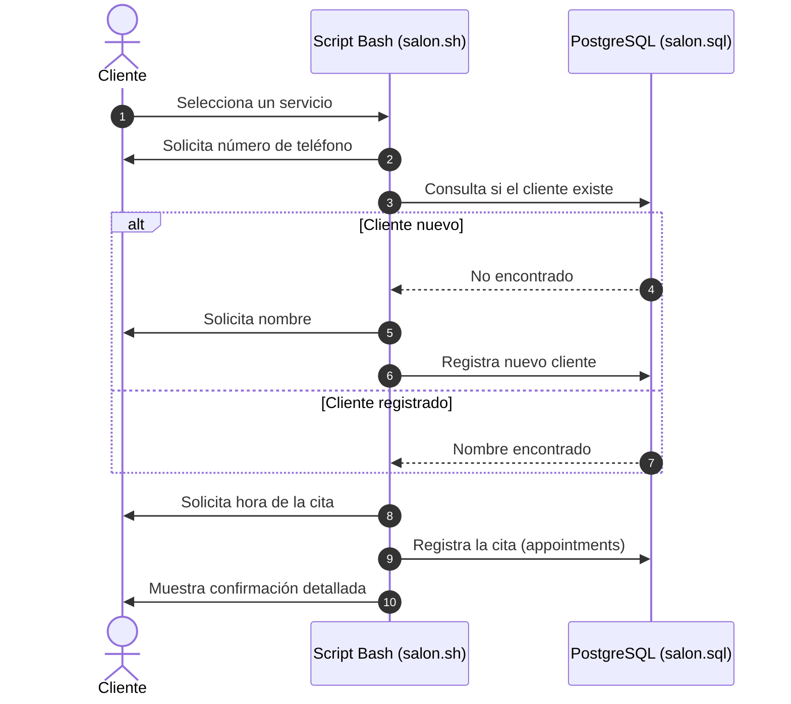

# ✂️ Salon Appointment Scheduler (PostgreSQL + Bash CLI)

Aplicación interactiva por línea de comandos (CLI) escrita en Bash y conectada a PostgreSQL para la gestión dinámica de clientes y agendamiento de citas en un salón de belleza.

---

## ⚡ Flujo de la Aplicación



---

## ✨ Características Clave
* **Interface de Consola Interactiva:** Menús dinámicos con manejo de errores e insumos inválidos mediante funciones recursivas en Bash.
* **Flujo de Registro Inteligente:** Verificación de clientes existentes vía número telefónico para evitar registros duplicados.
* **Persistencia Relacional:** Gestión de tablas para servicios (`services`), clientes (`customers`) y citas (`appointments`) con claves foráneas.
* **Formateo de Datos:** Limpieza de espacios en blanco sobrantes devueltos por psql para presentar mensajes claros al usuario.

## 🛠️ Tecnologías Utilizadas
* Base de Datos: PostgreSQL
* Lenguaje: Bash / Shell Scripting (`psql` CLI)

## 🚀 Instalación y Ejecución
### Prerrequisitos
Tener instalado y configurado PostgreSQL en tu entorno local.
### Pasos
1. **Clonar el repositorio:**
```bash
  git clone https://github.com/Aki-new/salon-appointment-scheduler.git
  cd salon-appointment-scheduler
```
2. **Crear e importar el esquema de la base de datos:**
```bash
 psql -U postgres < salon.sql
```
3. **Dar permisos de ejecución e iniciar la aplicación:**
```bash
 chmod +x salon.sh
 ./salon.sh
```

---

## 📜 Créditos y Reconocimientos

* **Origen de la consigna / dataset:** Este proyecto es uno de los desafíos requeridos para la obtención de la **Certificación de Bases de Datos Relacionales** de [freeCodeCamp](https://www.freecodecamp.org/).
* **Implementación:** La lógica de scripts en Bash (`insert_data.sh`), la estructuración del esquema PostgreSQL (`worldcup.sql`) y la elaboración de consultas analíticas (`queries.sh`) fueron desarrolladas por completo como resolución individual al problema planteado.
